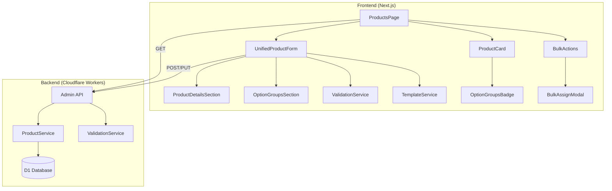

# Design Document: Admin Product Options UI

## Overview

هذا التصميم يهدف لتحسين واجهة إدارة المنتجات في لوحة التحكم لضمان الإدخالات الصحيحة وترابط البيانات. النظام الحالي يفصل بين إنشاء المنتج وربطه بالخيارات، مما يسبب مشاكل في تناسق البيانات. التصميم الجديد يدمج العمليتين في فورم موحد مع validation قوي.

### Key Improvements
1. **Unified Form**: دمج إنشاء المنتج وربط الخيارات في فورم واحد
2. **Smart Templates**: قوالب جاهزة حسب نوع المنتج
3. **Real-time Validation**: تحقق فوري من صحة البيانات
4. **Visual Feedback**: عرض مرئي للعلاقات والتحذيرات

## Architecture



## Components and Interfaces

### 1. UnifiedProductForm Component

```typescript
// src/components/admin/products/UnifiedProductForm.tsx

interface UnifiedProductFormProps {
  isOpen: boolean;
  onClose: () => void;
  editingProduct: Product | null;
  onSubmit: (data: UnifiedProductData) => Promise<void>;
  optionGroups: OptionGroup[];
  containers: Container[];
  sizes: Size[];
}

interface UnifiedProductData {
  // Product Details
  product: ProductFormData;
  // Option Groups Assignment
  optionGroupAssignments: OptionGroupAssignment[];
  // Containers Assignment
  containerAssignments: ContainerAssignment[];
  // Sizes Assignment
  sizeAssignments: SizeAssignment[];
}

interface OptionGroupAssignment {
  groupId: string;
  isRequired: boolean;
  minSelections: number;
  maxSelections: number;
  priceOverride?: number;
  displayOrder: number;
}

interface ContainerAssignment {
  containerId: string;
  isDefault: boolean;
}

interface SizeAssignment {
  sizeId: string;
  isDefault: boolean;
}
```

### 2. ValidationService

```typescript
// src/lib/admin/validation.ts

interface ValidationResult {
  isValid: boolean;
  errors: ValidationError[];
  warnings: ValidationWarning[];
}

interface ValidationError {
  field: string;
  message: string;
  code: string;
}

interface ValidationWarning {
  field: string;
  message: string;
  code: string;
}

// Validation functions
function validateProductData(data: ProductFormData): ValidationResult;
function validateOptionGroupAssignment(assignment: OptionGroupAssignment, group: OptionGroup): ValidationResult;
function validateUnifiedProductData(data: UnifiedProductData): ValidationResult;
```

### 3. TemplateService

```typescript
// src/lib/admin/templates.ts

interface ProductTemplate {
  productType: string;
  suggestedGroups: SuggestedGroup[];
  suggestedContainers: boolean;
  suggestedSizes: boolean;
}

interface SuggestedGroup {
  groupId: string;
  defaultConfig: Partial<OptionGroupAssignment>;
}

// Template definitions
const PRODUCT_TEMPLATES: Record<string, ProductTemplate> = {
  byo_ice_cream: {
    productType: 'byo_ice_cream',
    suggestedGroups: [
      { groupId: 'flavors', defaultConfig: { isRequired: true, minSelections: 1, maxSelections: 3 } },
      { groupId: 'toppings', defaultConfig: { isRequired: false, minSelections: 0, maxSelections: 5 } },
      { groupId: 'sauces', defaultConfig: { isRequired: false, minSelections: 0, maxSelections: 2 } },
    ],
    suggestedContainers: true,
    suggestedSizes: true,
  },
  milkshake: {
    productType: 'milkshake',
    suggestedGroups: [
      { groupId: 'flavors', defaultConfig: { isRequired: true, minSelections: 1, maxSelections: 2 } },
    ],
    suggestedContainers: false,
    suggestedSizes: true,
  },
  standard: {
    productType: 'standard',
    suggestedGroups: [],
    suggestedContainers: false,
    suggestedSizes: false,
  },
};

function getTemplateForProductType(productType: string): ProductTemplate;
function applySuggestedGroups(template: ProductTemplate, availableGroups: OptionGroup[]): OptionGroupAssignment[];
```

### 4. OptionGroupsBadge Component

```typescript
// src/components/admin/products/OptionGroupsBadge.tsx

interface OptionGroupsBadgeProps {
  productId: string;
  assignedGroups: AssignedGroupInfo[];
}

interface AssignedGroupInfo {
  groupId: string;
  groupName: string;
  groupIcon: string;
  isRequired: boolean;
  optionsCount: number;
}
```

### 5. BulkAssignModal Component

```typescript
// src/components/admin/products/BulkAssignModal.tsx

interface BulkAssignModalProps {
  isOpen: boolean;
  onClose: () => void;
  selectedProducts: Product[];
  optionGroups: OptionGroup[];
  onConfirm: (assignment: OptionGroupAssignment) => Promise<BulkAssignResult>;
}

interface BulkAssignResult {
  success: string[];  // Product IDs that succeeded
  failed: { productId: string; error: string }[];
}
```

## Data Models

### Database Schema (Existing - No Changes)

```sql
-- products table (existing)
-- option_groups table (existing)
-- options table (existing)
-- product_options table (existing - junction table)
-- product_containers table (existing)
-- product_size_options table (existing)
```

### API Request/Response Models

```typescript
// POST /admin/products (unified creation)
interface CreateProductRequest {
  product: {
    id: string;
    name: string;
    nameEn?: string;
    category: string;
    categoryEn?: string;
    price: number;
    description?: string;
    descriptionEn?: string;
    image?: string;
    badge?: string;
    available: number;
    product_type: string;
    // ... nutrition fields
  };
  optionGroups?: OptionGroupAssignment[];
  containers?: ContainerAssignment[];
  sizes?: SizeAssignment[];
}

// GET /admin/products/:id/full
interface ProductFullResponse {
  success: boolean;
  data: {
    product: Product;
    optionGroups: (OptionGroupAssignment & { group: OptionGroup })[];
    containers: (ContainerAssignment & { container: Container })[];
    sizes: (SizeAssignment & { size: Size })[];
  };
}
```

## Correctness Properties

*A property is a characteristic or behavior that should hold true across all valid executions of a system-essentially, a formal statement about what the system should do. Properties serve as the bridge between human-readable specifications and machine-verifiable correctness guarantees.*

### Property 1: Product Type Template Suggestions
*For any* product type selection, the suggested option groups SHALL match the predefined template for that product type.
**Validates: Requirements 1.2**

### Property 2: Required Fields Validation
*For any* form submission with missing required fields (id, name, category, price), the system SHALL reject the submission and return validation errors.
**Validates: Requirements 1.4**

### Property 3: Atomic Save Operations
*For any* product creation or update operation, either all data (product, option_groups, containers, sizes) SHALL be saved successfully, or none SHALL be saved (rollback on failure).
**Validates: Requirements 1.5, 2.4**

### Property 4: Product Data Loading Consistency
*For any* existing product opened for editing, the loaded data SHALL exactly match the data stored in the database (product details + all assignments).
**Validates: Requirements 2.1**

### Property 5: Required Group Removal Warning
*For any* attempt to remove an option group that is marked as required, the system SHALL display a warning before allowing the removal.
**Validates: Requirements 2.3**

### Property 6: Min-Max Selection Validation
*For any* option group assignment where min_selections > max_selections, the system SHALL display an error and prevent saving.
**Validates: Requirements 3.1**

### Property 7: Required Group Auto-Correction
*For any* option group marked as required with min_selections = 0, the system SHALL automatically set min_selections to 1.
**Validates: Requirements 3.2**

### Property 8: Duplicate Group Prevention
*For any* attempt to assign the same option group twice to a product, the system SHALL prevent the duplicate and display an error.
**Validates: Requirements 3.3**

### Property 9: Max Selections Bounds Warning
*For any* option group assignment where max_selections > available options count in the group, the system SHALL display a warning.
**Validates: Requirements 3.4**

### Property 10: Option Groups Badge Accuracy
*For any* product in the products list, the displayed badge count SHALL equal the actual number of assigned option groups.
**Validates: Requirements 4.1**

### Property 11: Bulk Assignment Application
*For any* bulk assignment operation on a set of products, the system SHALL apply the configuration to all selected products and report individual success/failure status.
**Validates: Requirements 6.3**

### Property 12: Customizable Product Warning
*For any* product with a customizable product_type (byo_ice_cream, milkshake) but no assigned option groups, the system SHALL display a warning.
**Validates: Requirements 7.1**

### Property 13: Missing Defaults Warning
*For any* product with assigned containers or sizes but no default selection, the system SHALL display a warning.
**Validates: Requirements 7.2**

## Error Handling

### Frontend Validation Errors

| Error Code | Condition | User Message |
|------------|-----------|--------------|
| `MISSING_ID` | Product ID is empty | معرف المنتج مطلوب |
| `MISSING_NAME` | Product name is empty | اسم المنتج مطلوب |
| `MISSING_CATEGORY` | Category is empty | الفئة مطلوبة |
| `MISSING_PRICE` | Price is empty or invalid | السعر مطلوب |
| `INVALID_MIN_MAX` | min_selections > max_selections | الحد الأدنى لا يمكن أن يكون أكبر من الحد الأقصى |
| `DUPLICATE_GROUP` | Same group assigned twice | هذه المجموعة مضافة بالفعل |

### Frontend Validation Warnings

| Warning Code | Condition | User Message |
|--------------|-----------|--------------|
| `NO_OPTION_GROUPS` | Customizable product with no groups | المنتج قابل للتخصيص لكن لا توجد مجموعات خيارات |
| `NO_DEFAULT_CONTAINER` | Containers assigned but no default | لم يتم تحديد حاوية افتراضية |
| `NO_DEFAULT_SIZE` | Sizes assigned but no default | لم يتم تحديد مقاس افتراضي |
| `MAX_EXCEEDS_OPTIONS` | max_selections > options count | الحد الأقصى أكبر من عدد الخيارات المتاحة |

### Backend Error Responses

```typescript
// 400 Bad Request
{ error: 'Missing required fields', fields: ['id', 'name'] }

// 409 Conflict
{ error: 'Product ID already exists' }

// 500 Internal Server Error
{ error: 'Failed to save product', details: 'Database error' }
```

## Testing Strategy

### Unit Testing

Unit tests will cover:
- Validation functions (validateProductData, validateOptionGroupAssignment)
- Template service functions (getTemplateForProductType, applySuggestedGroups)
- Data transformation functions

### Property-Based Testing

The project will use **fast-check** library for property-based testing in TypeScript/JavaScript.

Each property-based test will:
- Run a minimum of 100 iterations
- Be tagged with the format: `**Feature: admin-product-options-ui, Property {number}: {property_text}**`
- Reference the specific correctness property from this design document

Property tests will focus on:
1. Validation logic (Properties 2, 6, 7, 8, 9)
2. Template suggestions (Property 1)
3. Data consistency (Properties 4, 10)
4. Warning conditions (Properties 5, 12, 13)

### Integration Testing

Integration tests will verify:
- API endpoints for unified product creation/update
- Database transaction atomicity (Property 3)
- Bulk operations (Property 11)

