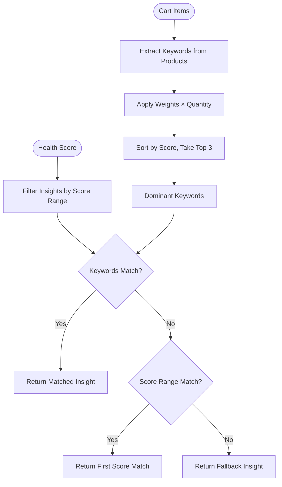

# Health-Driven Cart - Data Flow Diagram

## مخطط تدفق البيانات

```mermaid
flowchart TB
    subgraph Database["🗄️ Cloudflare D1 Database"]
        Products[(products table)]
        Products --> |health_keywords JSON| HK[health_keywords]
        Products --> |health_benefit_ar TEXT| HB[health_benefit_ar]
    end

    subgraph Backend["⚡ Cloudflare Workers API"]
        API["/api/products/:id"]
        API --> |GET| Products
    end

    subgraph Frontend["🖥️ Next.js Frontend"]
        subgraph CartModal["CartModal Component"]
            Cart[Cart Items]
            Fetch[Fetch Products]
            
            Cart --> Fetch
            Fetch --> |getProduct API| API
        end

        subgraph HealthSystem["💚 Health System"]
            ParseKW[parseHealthKeywords]
            CalcScore[calculateHealthScore]
            SelectInsight[selectHealthInsight]
            
            Fetch --> |product.health_keywords| ParseKW
            ParseKW --> |HealthKeyword[]| SelectInsight
            
            Cart --> |nutrition data| CalcScore
            CalcScore --> |score 0-100| SelectInsight
        end

        subgraph InsightSelection["🎯 Insight Selection Algorithm"]
            ExtractDom[extractDominantKeywords]
            FilterScore[Filter by Score Range]
            MatchKW[Match by Keywords]
            Fallback[Return Fallback]
            
            SelectInsight --> ExtractDom
            ExtractDom --> |weighted keywords| FilterScore
            FilterScore --> MatchKW
            MatchKW --> |no match| Fallback
        end

        subgraph UI["🎨 UI Components"]
            HealthyMeter[HealthyMeter]
            InsightCard[HealthInsightCard]
            
            CalcScore --> |HealthScoreResult| HealthyMeter
            SelectInsight --> |HealthInsight| InsightCard
        end
    end

    subgraph Admin["👨‍💼 Admin Panel"]
        ProductForm[ProductForm]
        KeywordSelect[Multi-Select Keywords]
        BenefitInput[Health Benefit Input]
        
        ProductForm --> KeywordSelect
        ProductForm --> BenefitInput
        KeywordSelect --> |validate| Validation[validateHealthKeywords]
        Validation --> |save| API
    end

    style Database fill:#e1f5fe
    style Backend fill:#fff3e0
    style Frontend fill:#e8f5e9
    style Admin fill:#fce4ec
```

## تدفق البيانات التفصيلي

### 1️⃣ تخزين البيانات (Database)

```
products table
├── id: TEXT (PRIMARY KEY)
├── name: TEXT
├── ... (other fields)
├── health_keywords: TEXT (JSON array)
│   └── Example: '["high-protein", "low-sugar"]'
└── health_benefit_ar: TEXT
    └── Example: 'غني بالبروتين ومنخفض السكر'
```

### 2️⃣ جلب البيانات (API → Frontend)

```
GET /api/products/:id
    ↓
Response: {
    id: "23",
    name: "شوكولاتة بروتين",
    health_keywords: '["high-protein", "low-sugar"]',
    health_benefit_ar: "عالي البروتين ومنخفض السكر",
    calories: 185,
    protein: 12.5,
    sugar: 12,
    ...
}
```

### 3️⃣ معالجة البيانات (Frontend)

```typescript
// 1. Parse health keywords from JSON string
const keywords = parseHealthKeywords(product.health_keywords)
// Result: ['high-protein', 'low-sugar']

// 2. Calculate health score from nutrition
const healthScore = calculateHealthScore(cartItems, productsMap)
// Result: { score: 75, level: 'Good', color: '#84cc16', ... }

// 3. Select appropriate insight
const result = selectHealthInsight(healthScore.score, cartItemsWithKeywords)
// Result: {
//   insight: { id: 'high_protein', message: {...}, ... },
//   dominantKeywords: ['high-protein', 'low-sugar'],
//   matchReason: 'keyword'
// }
```

### 4️⃣ عرض البيانات (UI)

```
CartModal
├── Cart Items List
├── HealthyMeter
│   ├── Score: 75/100
│   ├── Level: جيد
│   └── Progress Bar (animated)
└── HealthInsightCard
    ├── Emoji: 💪
    ├── Title: قوة البروتين
    └── Lines: [
          "اختياراتك غنية بالبروتين...",
          "البروتين يساعد في الشعور بالشبع...",
          "طعم لذيذ + فوائد صحية..."
        ]
```

## خوارزمية اختيار الـ Insight



## أوزان الكلمات المفتاحية

| Keyword | Weight | Category |
|---------|--------|----------|
| high-protein | 3 | nutritional |
| low-sugar | 3 | nutritional |
| calcium | 2 | nutritional |
| fiber-rich | 2 | nutritional |
| probiotic | 2 | nutritional |
| energy-boost | 1 | lifestyle |
| indulgent | 1 | lifestyle |
| balanced | 1 | lifestyle |
| refreshing | 1 | lifestyle |

## نطاقات الـ Health Score

| Score Range | Level | Insight Category |
|-------------|-------|------------------|
| 70-100 | Excellent/Good | high_protein, low_sugar |
| 50-70 | Fair | balanced |
| 30-50 | Poor | indulgent |
| 0-30 | Very Poor | fallback |
