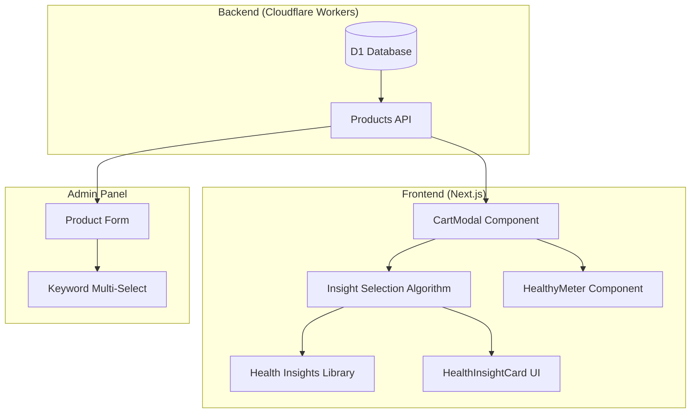

# Design Document: Health-Driven Cart Experience

## Overview

هذا التصميم يحول تجربة Cart في Soft Cream من عرض بسيط للمنتجات إلى تجربة صحية تفاعلية. النظام يتكون من:

1. **Backend**: إضافة حقول صحية للمنتجات (health_keywords, health_benefit_ar)
2. **Frontend**: مكتبة Health Insights + خوارزمية اختيار ذكية + UI component جديد
3. **Admin**: واجهة لإدارة الـ keywords لكل منتج
4. **Performance**: تحسينات لضمان INP < 200ms

## Architecture



## Components and Interfaces

### 1. Database Schema Changes

```sql
-- Migration: Add health fields to products table
ALTER TABLE products ADD COLUMN health_keywords TEXT DEFAULT NULL;
ALTER TABLE products ADD COLUMN health_benefit_ar TEXT DEFAULT NULL;

-- health_keywords stores JSON array: ["high-protein", "low-sugar"]
-- health_benefit_ar stores Arabic text: "غني بالبروتين ومنخفض السكر"
```

### 2. Health Keywords Taxonomy

```typescript
// src/lib/health/keywords.ts
export const HEALTH_KEYWORDS = {
  // High Priority (weight: 3)
  'high-protein': { weight: 3, category: 'nutritional', label_ar: 'عالي البروتين' },
  'low-sugar': { weight: 3, category: 'nutritional', label_ar: 'منخفض السكر' },
  
  // Medium Priority (weight: 2)
  'calcium': { weight: 2, category: 'nutritional', label_ar: 'غني بالكالسيوم' },
  'fiber-rich': { weight: 2, category: 'nutritional', label_ar: 'غني بالألياف' },
  'probiotic': { weight: 2, category: 'nutritional', label_ar: 'بروبيوتيك' },
  
  // Low Priority (weight: 1)
  'energy-boost': { weight: 1, category: 'lifestyle', label_ar: 'يعزز الطاقة' },
  'indulgent': { weight: 1, category: 'lifestyle', label_ar: 'للاستمتاع' },
  'balanced': { weight: 1, category: 'lifestyle', label_ar: 'متوازن' },
  'refreshing': { weight: 1, category: 'lifestyle', label_ar: 'منعش' },
} as const;

export type HealthKeyword = keyof typeof HEALTH_KEYWORDS;
```

### 3. Health Insights Library

```typescript
// src/lib/health/insights.ts
export interface HealthInsight {
  id: string;
  keywords: HealthKeyword[];
  scoreRange: [number, number]; // [min, max]
  message: {
    title: string;
    emoji: string;
    lines: string[]; // Max 3 lines
  };
}

export const HEALTH_INSIGHTS: HealthInsight[] = [
  {
    id: 'high_protein',
    keywords: ['high-protein'],
    scoreRange: [60, 100],
    message: {
      title: 'قوة البروتين',
      emoji: '💪',
      lines: [
        'اختياراتك غنية بالبروتين - وقود ممتاز للعضلات!',
        'البروتين يساعد في الشعور بالشبع لفترة أطول.',
        'طعم لذيذ + فوائد صحية = الفوز المزدوج! 🏆'
      ]
    }
  },
  {
    id: 'low_sugar',
    keywords: ['low-sugar'],
    scoreRange: [70, 100],
    message: {
      title: 'اختيار واعي',
      emoji: '🌱',
      lines: [
        'رائع! اختياراتك منخفضة السكر تدعم طاقة متوازنة.',
        'أنت تثبت أن الطعم اللذيذ لا يحتاج لكميات كبيرة من السكر!',
        'استمر في هذا النهج الصحي! 💚'
      ]
    }
  },
  {
    id: 'balanced',
    keywords: ['balanced', 'calcium', 'fiber-rich'],
    scoreRange: [50, 70],
    message: {
      title: 'توازن مثالي',
      emoji: '⚖️',
      lines: [
        'اختياراتك تعكس توازناً جيداً بين المتعة والصحة!',
        'الاعتدال هو مفتاح نمط حياة صحي ومستدام.',
        'استمتع بكل لقمة بدون شعور بالذنب! 😊'
      ]
    }
  },
  {
    id: 'indulgent',
    keywords: ['indulgent', 'energy-boost'],
    scoreRange: [30, 50],
    message: {
      title: 'لحظة استمتاع',
      emoji: '🎉',
      lines: [
        'الحياة قصيرة لتفوت الحلويات اللذيذة!',
        'الاستمتاع من وقت لآخر جزء من نمط حياة متوازن.',
        'استمتع الآن، وازن لاحقاً! ✨'
      ]
    }
  },
  {
    id: 'fallback',
    keywords: [],
    scoreRange: [0, 100],
    message: {
      title: 'استمتع بالطعم',
      emoji: '🍦',
      lines: [
        'كل منتج في سلتك مصنوع بحب واهتمام بالجودة.',
        'التوازن على المدى الطويل أهم من الكمال في كل وجبة.',
        'استمتع بكل لحظة! 💚'
      ]
    }
  }
];
```

### 4. Insight Selection Algorithm

```typescript
// src/lib/health/selectInsight.ts
export interface CartItemWithKeywords {
  productId: string;
  quantity: number;
  health_keywords: HealthKeyword[];
}

export function extractDominantKeywords(
  cartItems: CartItemWithKeywords[]
): HealthKeyword[] {
  const keywordScores = new Map<HealthKeyword, number>();
  
  cartItems.forEach(item => {
    item.health_keywords.forEach(kw => {
      const weight = HEALTH_KEYWORDS[kw]?.weight || 1;
      const score = weight * item.quantity;
      keywordScores.set(kw, (keywordScores.get(kw) || 0) + score);
    });
  });
  
  return Array.from(keywordScores.entries())
    .sort((a, b) => b[1] - a[1])
    .slice(0, 3)
    .map(([kw]) => kw);
}

export function selectHealthInsight(
  healthScore: number,
  cartItems: CartItemWithKeywords[]
): HealthInsight {
  const dominantKeywords = extractDominantKeywords(cartItems);
  
  // Filter by score range first
  const scoreMatchedInsights = HEALTH_INSIGHTS.filter(
    insight => healthScore >= insight.scoreRange[0] && healthScore <= insight.scoreRange[1]
  );
  
  // Then match by keywords
  const keywordMatchedInsight = scoreMatchedInsights.find(insight =>
    insight.keywords.length > 0 &&
    insight.keywords.some(kw => dominantKeywords.includes(kw))
  );
  
  // Return matched or fallback
  return keywordMatchedInsight || HEALTH_INSIGHTS.find(i => i.id === 'fallback')!;
}
```

### 5. HealthInsightCard Component

```typescript
// src/components/modals/CartModal/HealthInsightCard.tsx
interface HealthInsightCardProps {
  insight: HealthInsight;
  onDismiss?: () => void;
}

// Uses framer-motion for animations
// Gradient background: from-green-50 to-blue-50
// Appears with 0.5s delay after cart opens
// Max 3 lines of content
```

## Data Models

### Product (Extended)

```typescript
interface Product {
  // ... existing fields
  health_keywords: string | null;  // JSON array stored as TEXT
  health_benefit_ar: string | null; // Arabic text
}

// Parsed health_keywords
interface ProductHealthData {
  health_keywords: HealthKeyword[];
  health_benefit_ar: string | null;
}
```

### Health Insight Selection Result

```typescript
interface InsightSelectionResult {
  insight: HealthInsight;
  dominantKeywords: HealthKeyword[];
  healthScore: number;
  matchReason: 'keyword' | 'score_range' | 'fallback';
}
```

## Correctness Properties

*A property is a characteristic or behavior that should hold true across all valid executions of a system-essentially, a formal statement about what the system should do. Properties serve as the bridge between human-readable specifications and machine-verifiable correctness guarantees.*

### Property 1: Health Fields Round-Trip Consistency
*For any* product with health_keywords and health_benefit_ar values, storing then retrieving the product should return equivalent health data (JSON array parsed correctly, Arabic text preserved).
**Validates: Requirements 1.1, 1.2**

### Property 2: Insight Lines Maximum Length
*For any* health insight in the library, the lines array should contain at most 3 elements.
**Validates: Requirements 2.2**

### Property 3: Insight Structure Completeness
*For any* health insight returned by the library, it should contain a non-empty title, a non-empty emoji, a lines array, and a keywords array.
**Validates: Requirements 2.4**

### Property 4: Keyword Weight Application
*For any* cart with products containing health_keywords, the dominant keyword calculation should apply the correct weights and multiply by quantity.
**Validates: Requirements 3.1, 3.2**

### Property 5: Insight Selection Order
*For any* health score and cart combination, the insight selection should first filter by score range, then match by keywords, returning fallback only when no keyword matches.
**Validates: Requirements 3.3**

### Property 6: Health Score Bounds
*For any* cart (empty or non-empty), the calculated health score should be a number between 0 and 100 inclusive.
**Validates: Requirements 4.3**

### Property 7: Health Score Includes All Nutrition
*For any* cart with products and customizations, the health score calculation should include nutrition values from all items and their customizations.
**Validates: Requirements 4.1, 4.2**

### Property 8: Insight Emoji Category Match
*For any* health insight, the emoji in the message should match the insight's category (💪 for protein, 🌱 for low-sugar, etc.).
**Validates: Requirements 6.4**

### Property 9: Keyword Validation
*For any* array of keywords submitted for a product, the validation should reject any keyword not in the predefined HEALTH_KEYWORDS list.
**Validates: Requirements 7.3**

### Property 10: Seed Keyword Assignment Rules
*For any* product in the seed data, the assigned health_keywords should contain at most 3 keywords, with specific keywords (high-protein, low-sugar) prioritized over generic ones (indulgent).
**Validates: Requirements 8.2, 8.3**

## Error Handling

### Database Errors
- If health_keywords JSON is malformed, treat as empty array
- If migration fails, rollback and preserve existing data
- Log errors but don't crash the application

### Frontend Errors
- If insight selection fails, show fallback insight
- If health score calculation fails, hide HealthyMeter
- If product fetch fails, show cart without health features

### Admin Errors
- Validate keywords before saving
- Show clear error messages in Arabic
- Prevent saving invalid data

## Testing Strategy

### Dual Testing Approach

This feature requires both unit tests and property-based tests:

1. **Unit Tests**: Verify specific examples and edge cases
2. **Property-Based Tests**: Verify universal properties across all inputs

### Property-Based Testing Framework

We will use **fast-check** for property-based testing in TypeScript/JavaScript.

```typescript
// Example test structure
import fc from 'fast-check';

describe('Health Insights', () => {
  // **Feature: health-driven-cart, Property 2: Insight Lines Maximum Length**
  test('all insights have at most 3 lines', () => {
    fc.assert(
      fc.property(
        fc.constantFrom(...HEALTH_INSIGHTS),
        (insight) => insight.message.lines.length <= 3
      ),
      { numRuns: 100 }
    );
  });
});
```

### Test Configuration
- Minimum 100 iterations per property test
- Each property test tagged with: `**Feature: health-driven-cart, Property {number}: {property_text}**`
- Tests should not use mocks for core logic

### Unit Test Coverage
- Edge cases: empty cart, null keywords, malformed JSON
- Integration: API endpoints, database operations
- UI: Component rendering, user interactions
